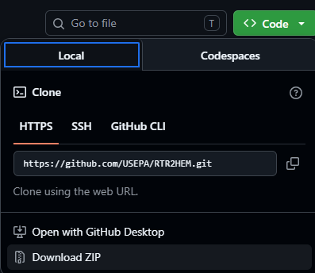

# RTR2HEM

RTR2HEM is a python-based executable tool that imports a modeling file from the Risk and Technology Review (RTR) program, or an export from the Emission Inventory System (EIS), converts the inventory to model input files for the Human Exposure Model version 4 (HEM4), and conducts RTR Tier 1 screening of human-health and ecological risks and hazards to selected persistent and bioaccumulative hazardous air pollutants (PB-HAPs).


## Running via Script

If it's not possible to run the executable version of the tool, and you're unfamiliar working with python/github, then the following process can be used to set up and run the RTR2HEM tool:

1. Download a .zip of the codebase and extract



2. Click `run_rtr2hem.bat`, which will install all necessary packages, including python, in an isolated environment using uv before launching the program. The `rtr2hem.ps1` script can also be ran directly by right clicking > "Run with PowerShell"

3. All outputs will be in the `outputs/` directory


## Virtual Environment

It is recommended to set up a virtual environment before installing the necessary packages (requirements.txt or pyproject.toml)

For example
```
python -m venv env
.\env\Scripts\activate
python -m pip install -r requirements.txt
```

The program can be ran with `python main.py`

## Building the Executable
All necessary files will be placed in an `/RTR2HEM/` folder after running:
```python
    python build.py
```

### Notes
- There may be restrictions (e.g. from IT, PC permissions, etc.) preventing the code from compiling or running successfully
- `static/` files may be modified as needed, however the file names must remain the same
- When running the executable, a log.txt is produced which can be used for debugging

## Additional Information

[Developer Notes](./docs/developer.md)